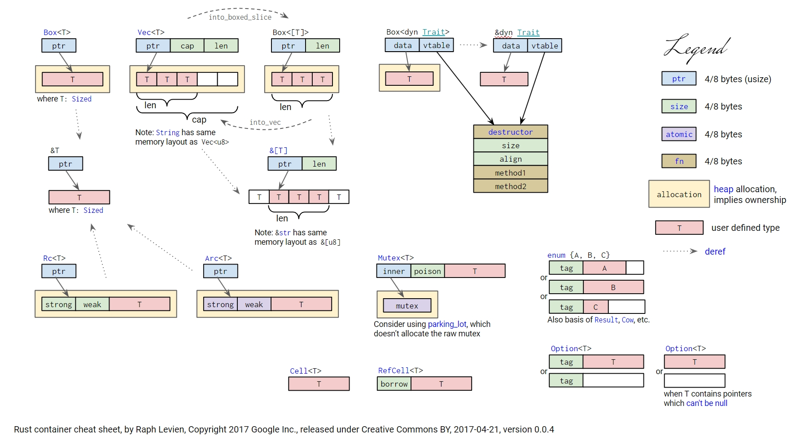

+++
title = "Rust 切片"
date = 2024-03-23
+++

## 切片定义

**切片是一种动态大小类型，表示 T 类型元素序列的“视图”。切片类型被写作 `[T]`。**

切片主要通过指针类型来使用
- `&[T]`：共享切片，经常被直接称作切片（对指向数据的不可变借用）
- `&mut [T]`：可变切片（对指向数据的可变借用）
- `Box<[T]>`：boxed 切片，拥有其所有权



## 切片 `[T]` 与数组 `[T; N]` 比较
1. 类型：`[T]` 是切片类型；`[T; N]` 是数组类型，且 `[T; 2]` 和 `[T; 3]` 是不同的数组类型
2. 编译期大小：`[T]` 是编译期未知大小（DST），而 `[T; N]` 是编译期已知大小的
3. 容量均不可变： `[T]` 与 `[T; N]` 可以改变元素内容，但容量不可变

## 切片引用 `&[T]` / `&mut [T]` 与普通引用 `&T` 的区别
切片引用是一个双字值的胖指针，包含指针和长度；而普通引用只包含指针。
```rust
let pointer_size = std::mem::size_of::<&u8>();
assert_eq!(pointer_size, std::mem::size_of::<&String>());
assert_eq!(2 * pointer_size, std::mem::size_of::<&str>());
assert_eq!(2 * pointer_size, std::mem::size_of::<&[u8]>());
assert_eq!(2 * pointer_size, std::mem::size_of::<*const [u8]>());
assert_eq!(2 * pointer_size, std::mem::size_of::<Box<[u8]>>());
assert_eq!(2 * pointer_size, std::mem::size_of::<Rc<[u8]>>());
```

## 字符串切片 `str`
`str` 类似 `[u8]` ，只不过 `str` 需要保证里面的字节内容是 UTF-8 编码的。

str 不仅指存放在程序只读区域的字面量，也可以指存放在堆上的字符串。
```rust
let s: &str = "hello";
let s: String = String::from(s);
let s: Box<str> = s.into_boxed_str();
```

在对字符串使用切片语法时需要格外小心，切片的索引必须落在字符之间的边界位置，也就是 UTF-8 字符的边界。

## 其他
1. 数组和字符串的许多方法（如遍历、搜索、排序等）是在切片上定义的
2. 通常如果 &String 和 &str 都可用的情况，优先使用 &str