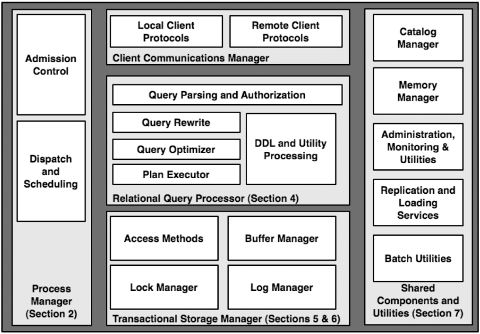
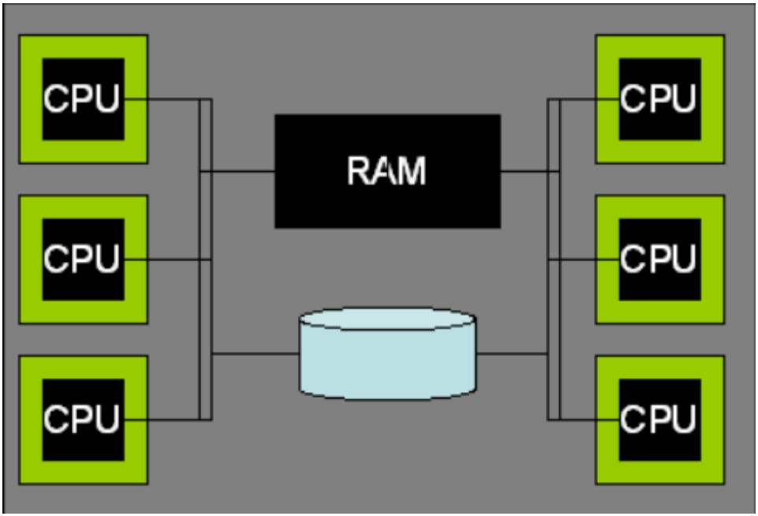
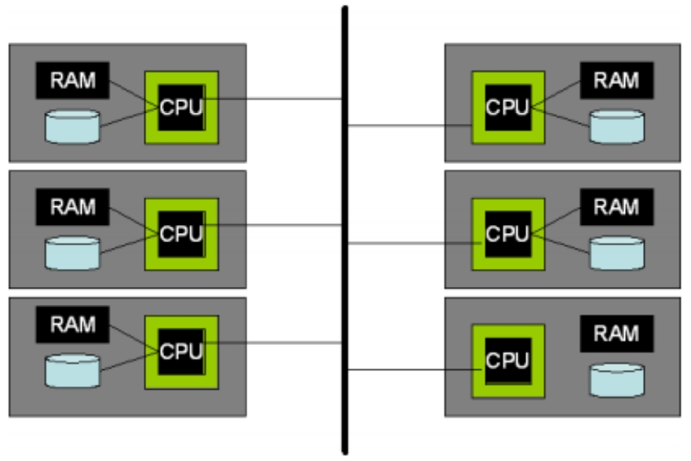
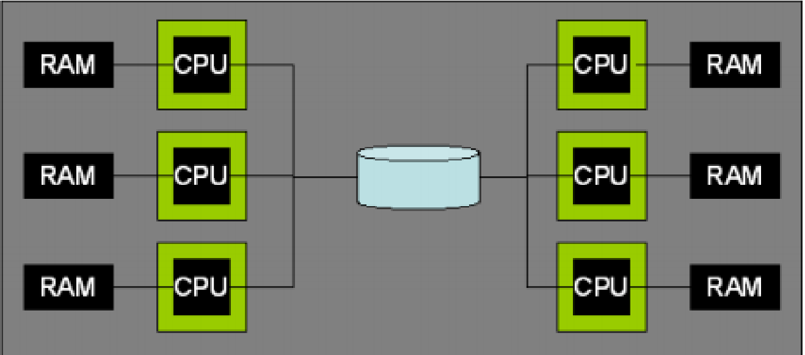
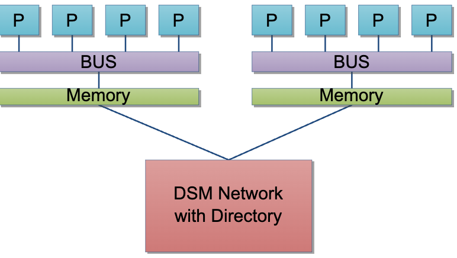

+++
title = "数据库系统架构论文"
date = 2024-03-26
+++

[论文](./architecture-of-a-database-system.pdf) | [中文翻译](./architecture-of-a-database-system-chinese.pdf)

## DBMS 主要组件


Process Manager 并非单指分配进程，而是根据 DBMS 实际实现的进程模型，分配进程或线程。其作用之一 Admission Control 指是否立即处理该查询，或是等待系统有足够资源时再处理。

## 进程模型
### 每个 DBMS Worker 一个进程
- 优点：可移植性好（早期的 OS 对线程支持较差），可以利用 OS 保护措施
- 缺点：进程切换代价更大
- 案例：DB2，PostgreSQL，Oracle

### 每个 DBMS Worker 一个线程
线程又可分为 OS线程 或 DBMS 线程（轻量级线程，仅在用户空间调度而没有内核调度程序的参与）。

- 优点：线程切换代价较小，共享数据友好
- 缺点：OS 对线程不提供溢出和指针的保护，调试困难，可移植性较差（在当时）
- 案例：DB2，SQL Server，MySQL

### 进程/线程池

由中央进程/线程控制所有客户端连接，由进程/线程池管理所有 DBMS worker。大小可动态变化。

DBMS worker 之间会共享数据
1. 磁盘缓冲池（buffer pool）
2. 锁表

DBMS 可能支持多种进程模型，比如 DB2 支持以上四种，Oracle 在 Windows 系统上采用多线程模型。

**准入控制**
1. 通过调度进程/线程来确保客户端连接数在一个临界值以下
2. 在查询语句转换和优化后的执行阶段，通过分析查询所需资源来决定是否推迟查询执行

## 并行架构

### 共享内存（Shared-Memory）


在共享内存机器，OS 通常支持作业（进程或线程）被透明地分配到每个处理器上，并且共享的数据结构可以继续被所有作业所访问，所以上面四种进程模型可以运行良好。主要需要修改查询执行层，将单一的 SQL 并行到多个处理器上。

### 无共享（Shared-Nothing）


通过网络互联通信。表数据被水平分区到不同机器，对于每个 SQL 请求，会被发送到集群其他成员，然后各自并行执行查询本地所保存的数据。事务实现较复杂。可扩展性强。需要冗余数据来提高可用性。

### 共享磁盘（Shared-Disk）


单个 DBMS 执行节点发生故障不会影响其他节点访问整个数据库。需要手动协调多个节点的共享数据（分布式锁，分布式缓冲池）。

### NUMA（Non-Uniform Memory Access）


处理器访问本地内存比远程内存更快。NUMA 允许共享内存系统扩展到更多数量处理器的规模。

## 关系查询处理器

### 查询解析

检查语法、引用、权限等，将 SQL 转换为内部形式（逻辑计划）。

### 查询重写

简化和标准化查询。例如
1. 视图重写
2. 简化常量表达式（`t.a < 10 + 2 + t.b`  =>  `t.a < 12 + t.b`）
3. 谓词逻辑重写（`t.a < 10 and t.a > 20`  =>  `false`）
4. 语义优化（`select t1.a from t1, t2 where t1.b = t2.b` 且 `外键约束把 t1.b 绑定到 t2.b`  =>  `select t1.a from t1`）

### 查询优化

将查询内部表示形式（逻辑计划）转化为一个高效的执行计划（物理计划）。涉及
1. 计划空间
2. 选择率估算（直方图）
3. 搜索算法（动态规划/级联搜索）
4. 并行（两阶段方案：先生成单机执行计划，再转换为分布式执行计划。单阶段方案则直接生成分布式执行计划）
5. 自动调优（如 learning optimizer）

### 查询执行

迭代器模型
```
class iterator {
    iterator &inputs[];
    void init();
    tuple get_next();
    void close();
}
```
可以通过引入 Exchange 算子来实现并行。

迭代器中元组可以是
1. 缓冲池中元组的引用（需要 pin 住所在页）
2. 从缓冲池中复制一份

**索引引用行**
1. 使用物理地址 RID（例如 page id + slot num），只支持二级索引（非聚簇索引，减少聚簇索引 B+ 树分裂导致频繁的行移动）。速度快，但行移动开销大
2. 使用主键。支持聚簇索引和二级索引，但二级索引回表会牺牲一些性能

**数据仓库特点**
1. 位图索引，min-max索引，布隆过滤
2. 需要快速批量导入数据
3. 物化视图（可以查询的实际表）
4. 重点优化基于雪花模型的聚合查询
5. 列存

## 存储管理

主要有两种基本类型的存储管理器
1. DBMS 直接和底层磁盘驱动交互
2. DBMS 使用标准 OS 文件系统

主要从两方面优化
1. 空间：物理存储上的临近性（顺序读写），创建大文件
2. 时间：缓冲池替代 OS IO 缓冲机制（预读取，确保 WAL 落盘，双缓冲导致内存拷贝消耗）

## 事务：并发控制和恢复
