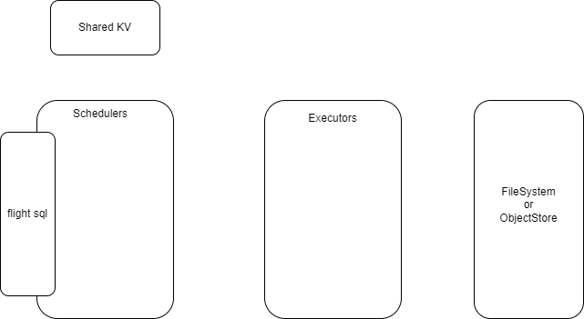

+++
title = "Ballista 分布式查询引擎 - 架构总览"
date = 2024-04-17
+++

[Ballista] 是基于 [Datafusion]（一个单机查询引擎）实现的类似 Spark SQL 的分布式查询引擎。

本系列主要基于 [ballista-mvp] 项目，它是从 [Ballista] 项目裁剪而来，保留其最小核心实现，方便学习，基于它来分析如何构建一个分布式查询引擎。

Scheduler 集群
- 支持 Arrow Flight SQL 协议
- 负责将原始 SQL 转换为分布式查询计划
- 负责调度整个分布式查询计划
- 将集群和作业状态存入共享 kv（如 etcd）

Executor 集群
- 支持 Arrow Flight 协议
- 负责查询计划执行
- 将中间结果存放本地磁盘
- 从共享文件系统或对象存储中读取数据集

一条 SQL 执行流程
1. Client 通过 Flight SQL 协议连接到 Scheduler 并发送原始 SQL
2. Scheduler 使用 Datafusion 查询引擎来生成单机的执行计划
3. Scheduler 将单机执行计划拆分成多个 stage 的 DAG 执行图，每个 stage 可以被独立调度执行
4. Scheduler 生成 Task（job-stage-partition）通过 protobuf 序列化后发送到 executor 集群并行执行
5. Executor 接收 Task 并执行，并将中间执行结果写入本地磁盘（供后续 stage 读取），并通知 Scheduler Task 执行状态
6. Scheduler 接收 Task 执行状态后，调度后续 stage 直至整个 DAG 图执行完毕
7. Scheduler 返回 SQL 执行结果给 Client

[Ballista]: https://github.com/apache/arrow-ballista
[Datafusion]: https://github.com/apache/arrow-datafusion
[ballista-mvp]: https://github.com/systemxlabs/ballista-mvp
