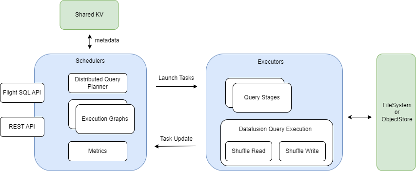

+++
title = "Ballista 分布式查询引擎 - 架构总览"
date = 2024-04-17
draft = true
+++

[Ballista] 是基于 [Datafusion] （一个单机查询引擎）实现的类 Spark SQL 的分布式查询引擎。

本系列主要基于 [ballista-mvp] 项目（它是从 [Ballista] 项目裁剪而来，保留其最小核心实现，方便学习），分析如何构建一个分布式查询引擎。

[Ballista]: https://github.com/apache/arrow-ballista
[Datafusion]: https://github.com/apache/arrow-datafusion
[ballista-mvp]: https://github.com/systemxlabs/ballista-mvp