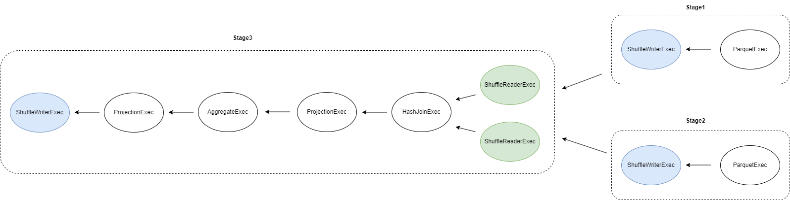

+++
title = "Ballista 分布式查询引擎 - 分布式执行计划"
date = 2024-04-19
draft = false
+++

## 生成分布式执行计划
**原始 SQL**
```sql
SELECT customer.c_custkey, sum(orders.o_totalprice) as total_amount 
FROM customer JOIN orders ON customer.c_custkey = orders.o_custkey 
GROUP BY customer.c_custkey;
```
注：customer 和 orders 两张表数据各分为 3 个 parquet 文件存储。

**使用 Datafusion 生成单机执行计划**
```
ProjectionExec: expr=[c_custkey@0 as c_custkey, SUM(orders.o_totalprice)@1 as total_amount]
  AggregateExec: mode=SinglePartitioned, gby=[c_custkey@0 as c_custkey], aggr=[SUM(orders.o_totalprice)]
    ProjectionExec: expr=[c_custkey@0 as c_custkey, o_totalprice@2 as o_totalprice]
      HashJoinExec: mode=Partitioned, join_type=Inner, on=[(c_custkey@0, o_custkey@0)]
        RepartitionExec: partitioning=Hash([c_custkey@0], 16), input_partitions=16
          RepartitionExec: partitioning=RoundRobinBatch(16), input_partitions=3
            ParquetExec: file_groups={3 groups: [...]}, projection=[c_custkey]
        RepartitionExec: partitioning=Hash([o_custkey@0], 16), input_partitions=16
          RepartitionExec: partitioning=RoundRobinBatch(16), input_partitions=3
            ParquetExec: file_groups={3 groups: [...]}, projection=[o_custkey, o_totalprice]
```

为什么会生成这样的单机执行计划？
1. Datafusion 提供了 target_partitions 配置项（默认为本机的 CPU 核心数量）来配置并行度，在生成单机执行计划时会插入 RepartitionExec 算子来调整 partition 数量。由于表数据分布在 3 个 parquet 文件，
ParquetExec 读取后输出 3 个 partition，因此在这里插入 RepartitionExec 算子将 partition 数量从 3 个提高到 16 个。（在分布式环境下为了利用多个机器，支持更高的并行度，Ballista 提供了可以给每个 session 手动配置此项的支持）
2. Datafusion 提供了 repartition_joins 开关项，基于 join key 进行 hash repartition 后可并行执行 hash join。
3. 这里其实还有优化空间，两个连续的 RepartitionExec 算子可以合并成一个（见 [issue-9370](https://github.com/apache/datafusion/issues/9370)）。


**生成初步的分布式执行计划**
```
=========ResolvedStage[stage_id=1.0, partitions=3]=========
ShuffleWriterExec: Some(Hash([Column { name: "c_custkey", index: 0 }], 16))
  ParquetExec: file_groups={3 groups: [...]}, projection=[c_custkey]

=========ResolvedStage[stage_id=2.0, partitions=3]=========
ShuffleWriterExec: Some(Hash([Column { name: "o_custkey", index: 0 }], 16))
  ParquetExec: file_groups={3 groups: [...]}, projection=[o_custkey, o_totalprice]

=========UnResolvedStage[stage_id=3.0, children=2]=========
ShuffleWriterExec: None
  ProjectionExec: expr=[c_custkey@0 as c_custkey, SUM(orders.o_totalprice)@1 as total_amount]
    AggregateExec: mode=SinglePartitioned, gby=[c_custkey@0 as c_custkey], aggr=[SUM(orders.o_totalprice)]
      ProjectionExec: expr=[c_custkey@0 as c_custkey, o_totalprice@2 as o_totalprice]
        HashJoinExec: mode=Partitioned, join_type=Inner, on=[(c_custkey@0, o_custkey@0)]
          UnresolvedShuffleExec
          UnresolvedShuffleExec
```
1. ResolvedStage 代表当前 stage 可以立即执行，UnResolvedStage 代表当前 stage 依赖的前置 stage 还没执行完毕。
2. join 的两个子树因为执行了 repartition 操作，因此会生成两个 stage：stage1 和 stage2。
3. 最终会在树的 root 那里再生成一个 stage：stage3，它依赖 stage1 和 stage2。

在 stage1 和 stage2 执行完毕后，stage3 会更新成如下
```
ShuffleWriterExec: None
  ProjectionExec: expr=[c_custkey@0 as c_custkey, SUM(orders.o_totalprice)@1 as total_amount]
    AggregateExec: mode=SinglePartitioned, gby=[c_custkey@0 as c_custkey], aggr=[SUM(orders.o_totalprice)]
      ProjectionExec: expr=[c_custkey@0 as c_custkey, o_totalprice@2 as o_totalprice]
        HashJoinExec: mode=Partitioned, join_type=Inner, on=[(c_custkey@0, o_custkey@0)]
          ShuffleReaderExec: partitions=16
          ShuffleReaderExec: partitions=16
```
UnsolvedShuffleExec 会被 ShuffleReaderExec 算子替代。

**最终的分布式执行计划**


为什么会生成这样的分布式执行计划？
1. Ballista 会在执行 repartition 的算子（如 RepartitionExec/CoalescePartitionsExec/SortPreservingMergeExec 算子，也被称为 pipeline breaker）那里插入 shuffle 算子，将单机执行计划分割成多个 stage，每个 stage 内部所有算子均为相同的分区方案。
2. 每个 stage 最终都会通过 ShuffleWriterExec 算子对执行结果 repartition （如有需要）并写入本地磁盘。
3. 每个有前置依赖的 stage 都会从 ShuffleReaderExec 算子开始执行，ShuffleReaderExec 算子负责读取前置 stage 产生的中间执行结果。

## Shuffle 算子

**ShuffleWriterExec 算子**
```rust
pub struct ShuffleWriterExec {
    /// 所属 job (即 query)，全局唯一
    job_id: String,
    /// stage id，job 内唯一
    stage_id: usize,
    /// stage 执行计划
    plan: Arc<dyn ExecutionPlan>,
    /// 中间结果写入磁盘目录
    work_dir: String,
    /// 输出的 partition 方案，空则代表不做 repartition
    shuffle_output_partitioning: Option<Partitioning>,
    /// 执行过程中的指标
    metrics: ExecutionPlanMetricsSet,
}  
```

1. work_dir 在生成分布式执行计划时为空，等到实际执行时，会被替换为 executor 的 work_dir。
2. 最终每个 stage 输出的每个 partition 数据以 Arrow IPC 格式存储
    - 当不做 repartition 时，数据存储在 `<work_dir>/<job_id>/<stage_id>/<partition>/data.arrow`
    - 当需要 repartition 时，数据存储在 `<work_dir>/<job_id>/<stage_id>/<output_partition>/data-<input_partition>.arrow`

**ShuffleReaderExec 算子**
```rust
pub struct ShuffleReaderExec {
    /// 需要读取的 stage id
    pub stage_id: usize,
    /// 输出的 schema
    pub(crate) schema: SchemaRef,
    /// 每个 partition 可以从多个位置读取
    pub partition: Vec<Vec<PartitionLocation>>,
    /// 执行过程中的指标
    metrics: ExecutionPlanMetricsSet,
}
```
1. 对于 partition 数据在本地的，直接从本地磁盘读取
2. 对于 partition 数据在其他 executor 上的，通过 Flight 协议流式读取

**UnresolvedShuffleExec 算子**
```
pub struct UnresolvedShuffleExec {
    pub stage_id: usize,
    pub schema: SchemaRef,
    pub output_partition_count: usize,
}  
```
主要起到占位符作用，等前置 stage 执行完毕后，UnresolvedShuffleExec 算子会被实际的 ShuffleReaderExec 算子替换。
