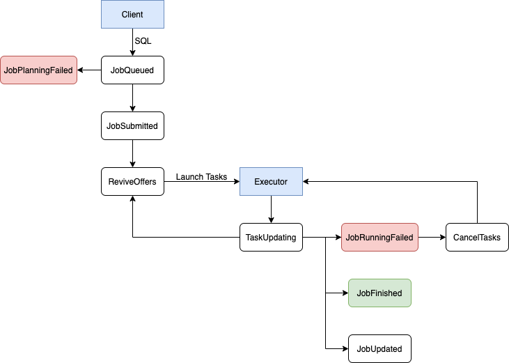

+++
title = "Ballista 分布式查询引擎 - 事件驱动调度"
date = 2024-04-23
+++

Ballista Scheduler 在调度整个 SQL 执行过程均通过事件驱动。

事件循环定义
```rust
pub struct EventLoop<E> {
    /// 事件循环名称
    pub name: String,
    /// 有界事件队列大小
    pub buffer_size: usize,
    /// 事件循环停止信号
    stopped: Arc<AtomicBool>,
    /// 根据事件执行对应动作
    action: Arc<dyn EventAction<E>>,
    /// 事件队列生产者
    tx_event: Option<mpsc::Sender<E>>,
}

#[async_trait]
pub trait EventAction<E>: Send + Sync {
    fn on_start(&self);

    fn on_stop(&self);

    async fn on_receive(
        &self,
        event: E,
        tx_event: &mpsc::Sender<E>,
        rx_event: &mpsc::Receiver<E>,
    ) -> Result<()>;

    fn on_error(&self, error: BallistaError);
}
```
1. 事件循环在启动时，会创建一个多生产者单消费者的有界事件队列，并启动一个异步任务去不断轮询事件队列消费端，直至收到 stop 信号。
2. 事件均通过生产者往队列发送

**一个 SQL 执行中的事件驱动过程**



1. 当接收到 Client 提交的 SQL 时，生成逻辑计划并发送 JobQueued 事件
2. 当接收到 JobQueued 事件后，基于逻辑计划生成单机执行计划，然后再生成分布式执行计划
    - 如果分布式执行计划生成成功，存入共享 kv 中，发送 JobSubmitted 事件
    - 如果分布式执行计划生成失败，则发送 JobPlanningFailed 事件
3. 当接收到 JobPlanningFailed 事件时，修改 job 状态为失败
4. 当接收到 JobSubmitted 事件时，发送 ReviveOffers 事件
5. 当接收到 ReviveOffers 事件时，遍历所有正在执行中的 job，生成 task 并发送给 Executor 集群
6. 当接收到 Executor 发送的任务状态更新时，发送 TaskUpdating 事件
7. 当接收到 TaskUpdating 事件时，释放集群计算资源，更新整个分布式执行计划的 stage 状态（Running -> Successful, Unresolved -> Resolved等），并发送 ReviveOffers 事件
    - 如果有 stage 从 Unsolved 状态变更为 Resolved 状态，则发送 JobUpdated 事件
    - 如果有 stage 执行失败，则修改 job 状态为失败，并发送 JobRunningFailed 事件
    - 如果所有 stage 均执行成功，则修改 job 状态为成功，并发送 JobFinished 事件
8. 当接收到 JobUpdated 事件时，更新共享 kv 中分布式执行计划
9. 当接收到 JobRunningFailed 事件时，更新共享 kv 中分布式执行计划，发送 CancelTasks 事件，向 Executor 集群发送清除 job 中间执行结果的请求，然后一段时间后从共享 kv 中移除该 job
10. 当接收到 CancelTasks 事件时，向 Executor 集群发送取消 task 执行的请求
11. 当接收到 JobFinished 事件时，更新共享 kv 中分布式执行计划，一段事件后向 Executor 集群发送清除 job 中间执行结果的请求，然后从共享 kv 中移除该 job