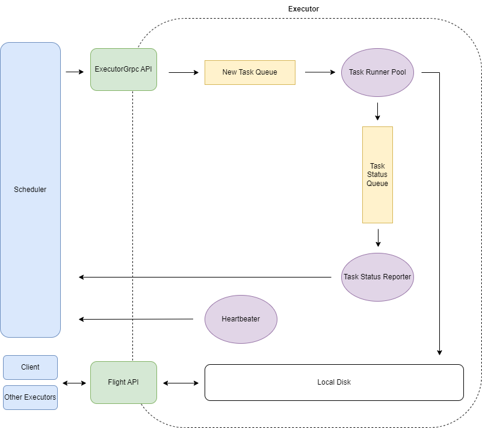

+++
title = "Ballista 分布式查询引擎 - 计划执行"
date = 2024-04-27
+++

所有计划的执行均由 Executor 节点负责。



Executor 节点启动时
1. 启动 ExecutorGrpc 服务，负责接收 Scheduler 节点发送的任务和其他指令。
2. 启动 Flight 服务，Client 和其他 Executor 通过 Flight 协议读取本机执行结果数据
3. 向 Scheduler 注册
4. 启动心跳任务，定时向所有 Scheduler 节点发送心跳
5. 启动任务执行池，负责轮询队列获取新任务并执行
6. 启动执行状态上报任务，负责上报任务状态给 Scheduler

Executor 执行的基本单元是 Task，一个 Task 会执行一个 Job 内的一个 stage 对应的一个 partition。
```rust
pub struct TaskDefinition {
    /// 在执行图中的唯一的（单调递增）
    pub task_id: usize,
    /// task 执行次数
    pub task_attempt_num: usize,
    /// 所属 job
    pub job_id: String,
    /// 所属 stage
    pub stage_id: usize,
    /// stage 执行次数
    pub stage_attempt_num: usize,
    /// partition
    pub partition_id: usize,
    /// stage 执行计划
    pub plan: Arc<dyn ExecutionPlan>,
    /// Scheduler 发起任务时间
    pub launch_time: u64,
    /// 所属会话
    pub session_id: String,
    /// 会话设置
    pub props: Arc<HashMap<String, String>>,
}
```

**Ballista 运行 CPU 密集型任务**

Ballista 采用 [Tokio](https://github.com/tokio-rs/tokio) 作为 Rust 异步运行时。Tokio 使用协作式调度，异步任务会在执行到 `.await` 时切换其他任务执行，使用 Tokio 须遵守 `"Async code should never spend a long time without reaching an .await."`（参考 Tokio maintainer 的[这篇博客](https://ryhl.io/blog/async-what-is-blocking/)）。因此 CPU 密集型任务会长时间占用 CPU，导致运行时上的其他任务无法被及时执行（如心跳）。

Ballista 解决此问题的办法是
1. 采用单独的运行时专门跑 CPU 密集型任务
2. IO 密集型任务运行时与 CPU 密集型任务运行时通过队列通信（创新新任务/任务执行结果通知）
3. 当然 CPU 密集型任务代码仍要遵守 `"Async code should never spend a long time without reaching an .await."`

更多细节可参考 Datafusion maintainer 的这篇文章：[https://thenewstack.io/using-rustlangs-async-tokio-runtime-for-cpu-bound-tasks/](https://thenewstack.io/using-rustlangs-async-tokio-runtime-for-cpu-bound-tasks/) 。
