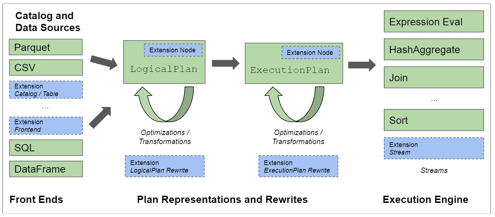
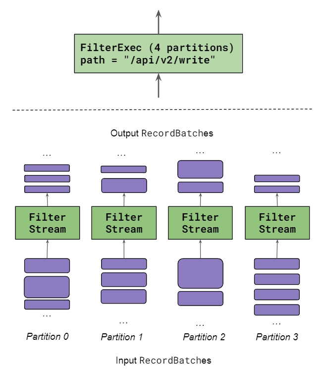
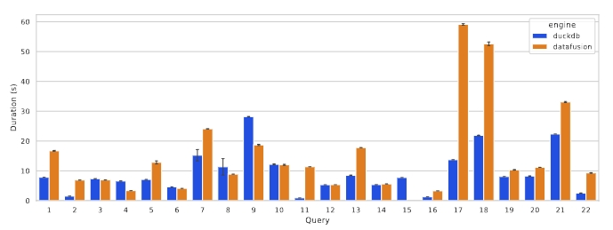
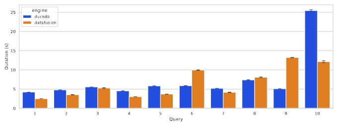
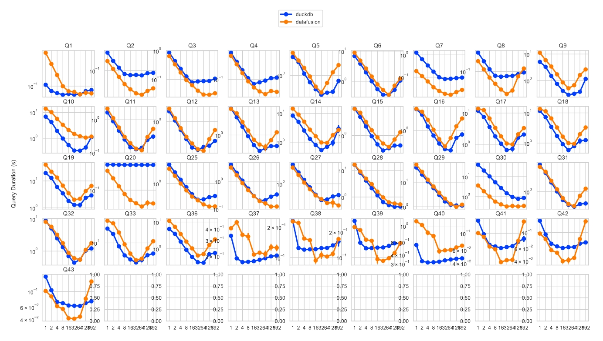

+++
title = "Apache DataFusion 查询引擎论文"
date = 2024-05-10
+++

[论文](./apache-datafusion-query-engine.pdf)

## 介绍
[DataFusion] 是一个 [Rust] 语言编写的、快速的、可嵌入的和可扩展的分析查询引擎，采用 [Apache Arrow] 作为它的内存数据格式。本论文主要描述它采用的技术以及如何适应如今数据库模块化的趋势，然后列举了其功能、优化、架构和扩展 API，最后通过与 [DuckDB] 比较来表明使用开放标准和可扩展性的设计并不会影响性能。

传统上，高性能分析查询引擎领域一直由紧密集成的系统主导（如 Vertica、Spark 和 DuckDB）。在如今机器学习等新需求催动下，重复造轮子开发新引擎人力昂贵且没有必要。DataFusion 具有竞争力的性能和可扩展性表明，现代 OLAP 引擎不需要一个紧密结合的架构。

## 基础生态
DataFusion 构建在以下基础技术之上
1. [Apache Arrow]：高效的列式内存数据格式，并提供一个高性能的计算核心
2. [Apache Parquet]: 列式存储文件格式，高效压缩和编码，内嵌 Schema，支持索引，支持 projection 和 filter 下推
3. [Rust]: 新的系统编程语言，内存安全，高性能，易嵌入其他系统（无 Runtime，C ABI 兼容），生态丰富，开发者友好（工具链，Cargo 包管理）

DataFusion 采用这些开放标准的技术，使其更容易与其他系统集成（直接可分享的文件和内存数据交换）。

## 使用案例
使用 DataFusion 可以不必重复造轮子，将人力放到更有价值的功能上面。
1. 定制数据库：如时序领域 InfluxDB 和 Coralogix，流数据处理 Synnada 和 Arroyo
2. 执行引擎：如作为 Spark 的执行引擎 Comet 和 Blaze，作为 PostgreSQL 的执行引擎 Seafowl
3. SQL 分析工具：如 dask-sql
4. 表格式：如 Delta Lake、Apache Iceberg 和 Lance 来用 DataFusion 来拉取和解码远端数据、谓词下推等功能

## 数据库模块化
一个长期趋势是数据库从“one size fits all”通用系统逐渐转向“fit for purpose”专用系统，这其中诞生了 Apache Calcite、Velox 和本项目。

类似于编译领域的 LLVM，模块化的设计催生出了 Rust、Swift、Zig 和 Julia 等语言。

## DataFusion 功能介绍


DataFusion 实现遵循业界最佳实践
1. Catalog 和 Data Sources：提供 schema、数据布局和位置信息。支持 parquet/avro/json/csv 等格式开箱即用
2. Front End：负责创建逻辑计划。支持 SQL 同时还提供了 DataFrame 和 LogicalPlanBuilder API
3. Optimizer：优化逻辑计划和表达式
4. PhysicalPlanner：将逻辑计划转为物理计划
5. PhysicalOptimizer：基于数据布局等信息优化物理计划
6. 物理计划采用流式执行

DataFusion 支持 Protobuf 和 Substrait 来序列化和反序列化逻辑计划和物理计划。

DataFusion 内置的开箱即用功能（如优化规则、用户自定义函数、Datasource）和用户扩展均使用同一个 API 实现。

**执行引擎**
```rust
impl Stream for MyOperator {
    ...
    // Pull next input (may yield at await)
    while let Some(batch) = stream.next().await {
        // Calculate, check if output is ready
        if Some(output) = self.process(&batch)? {
            // "Return" RecordBatch to output
            tx.send(batch).await
        }
    }
...
}
```
DataFusion 采用基于 Pull 的流式执行引擎。物理计划使用一个或多个 Stream 来并行执行，而 Stream 采用 Rust 异步实现并通过 Tokio 调度，实现了跟 `a NUMA-aware query evaluation framework for the many-core age` 论文类似的伸缩能力。



## 优化
内置实现了业界广泛使用的优化
1. 查询重写：逻辑计划重写如谓词下推、表达式简化，物理计划重写如消除不必要排序、最大化并行度、join算法。
2. 排序：如针对 Limit（topk）优化，内存不足时临时写入磁盘
3. 分组和聚合优化
4. 连接：支持 hash join/merge join/symmetric hash join/nested loops join/cross join
5. 窗口函数
6. Normalized Sort Keys / RowFormat
7. 有效利用排序顺序
8. 下推和延迟物化

## 扩展性
1. 用户自定义函数：标量/聚合/窗口
2. Catalog：TableProvider 表示一张表，SchemaProvider 是包含多个 TableProvider 的集合，CatalogProvider 是包含多个 SchemaProviders 的集合
3. Data Source：使用 TableProvider 表示，支持分区输入、谓词/filter/limit下推、预排序、统计信息等
4. Execution Environment：提供了 MemoryPool、DiskManager、CacheManager 等支持执行中写入临时磁盘、算子间共享资源
5. 新的查询前端
6. 查询重写：包括逻辑计划和物理计划
7. 关系运算符：使用 ExecutionPlan 来扩展新的运算符

用户均可扩展以上功能。

## 性能评估
**单核执行**
TPC-H



H2O-G



使用开发标准技术并不会从根本上限制 DataFusion 的性能。而且 DataFusion 社区正在针对这些 benchmark 做优化。

**多核执行**



DataFusion 的模块化设计和 Pull-based 执行引擎并不会阻碍获取最先进的多核性能。DataFusion 在多核上具有很好的伸缩性。

## 结论
自从引入 LLVM 以来，从头开始构建编译器的需求已显着减少。随着 DataFusion 等技术的出现，从头开始构建数据库系统的需求也将变得同样罕见。当然，如果有足够的工程投资，紧密集成的引擎理论上可以胜过模块化引擎。然而，随着实现最先进功能和性能的成本不断增加，我们相信广泛使用的模块化引擎（例如 DataFusion）将吸引其它大型开源社区的投资，并提供更丰富的功能集和除了拥有大量资源的紧密集成设计引擎之外的最好的性能。

模块化设计绝不是构建系统的唯一策略，我们不断看到新的紧密集成的系统的出现。然而，随着对 DataFusion 等系统的认识不断增强，我们预测会有更多项目采用模块化引擎，新的分析系统将会出现爆炸式增长，这在以前是不可能的。

注：论文标题为 Apache Arrow DataFusion 是因为在写论文时，[DataFusion] 是 [Apache Arrow] 项目下的一个子项目，而如今 [DataFusion] 已升级为 Apache 顶级项目。

[Apache Arrow]: https://arrow.apache.org/
[DataFusion]: https://datafusion.apache.org/
[DuckDB]: https://duckdb.org/
[Apache Parquet]: https://parquet.apache.org/
[Rust]: https://www.rust-lang.org/