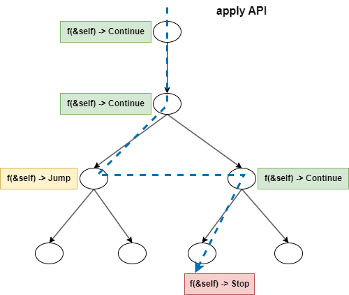
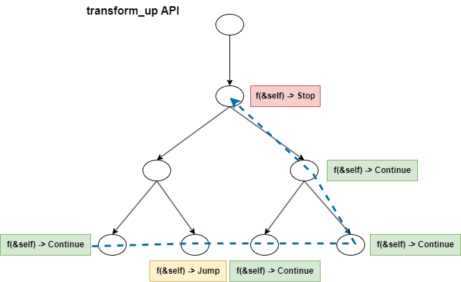

+++
title = "DataFusion 查询引擎 TreeNode APIs"
date = 2024-05-23
+++

数据库系统中有很多树形数据结构（如逻辑计划、表达式、物理计划），经常需要对这些树形结构遍历来进行检查（Inspecting）或者变换（Transforming），因此设计一个好的 API 可以事半功倍。DataFusion 中的 [TreeNode APIs] 设计具有很好的扩展性，其中的具体实现巧妙地利用了多种递归技巧，非常值得研究。

## 底层 API
```rust
pub trait TreeNode: Sized {
    fn apply_children<'n, F: FnMut(&'n Self) -> Result<TreeNodeRecursion, DataFusionError>>(
        &'n self,
        f: F,
    ) -> Result<TreeNodeRecursion, DataFusionError>;

    fn map_children<F: FnMut(Self) -> Result<Transformed<Self>, DataFusionError>>(
        self,
        f: F,
    ) -> Result<Transformed<Self>, DataFusionError>;
}

pub enum TreeNodeRecursion {
    Continue,
    Jump,
    Stop,
}

pub struct Transformed<T> {
    pub data: T,
    pub transformed: bool,
    pub tnr: TreeNodeRecursion,
}
```

这是两个底层 API，主要用来实现其他更高级的 API。而且它没有默认实现，因此必须手动实现。
- `apply_children` 接收一个 f 函数，将 f 函数应用到其每个子节点上，对每个子节点进行检查，直至 f 函数在某个子节点上返回 `TreeNodeRecursion::Stop` 指令，最终返回最后一次 f 函数执行的结果
- `map_children` 接收一个 f 函数，将 f 函数应用到其每个子节点上，对每个子节点进行变换，直至 f 函数在某个子节点上返回 `TreeNodeRecursion::Stop` 指令，最终返回更新后的父节点

## 检查 API
```rust
pub trait TreeNode: Sized {
    fn apply<'n, F: FnMut(&'n Self) -> Result<TreeNodeRecursion, DataFusionError>>(
        &'n self,
        mut f: F,
    ) -> Result<TreeNodeRecursion, DataFusionError> {
        fn apply_impl<'n, N: TreeNode, F: FnMut(&'n N) -> Result<TreeNodeRecursion, DataFusionError>>(
            node: &'n N,
            f: &mut F,
        ) -> Result<TreeNodeRecursion, DataFusionError> {
            f(node)?.visit_children(|| node.apply_children(|c| apply_impl(c, f)))
        }

        apply_impl(self, &mut f)
    }
}

impl TreeNodeRecursion {
    pub fn visit_children<F: FnOnce() -> Result<TreeNodeRecursion, DataFusionError>>(
        self,
        c: F,
    ) -> Result<TreeNodeRecursion, DataFusionError> {
        match self {
            TreeNodeRecursion::Continue => c(),
            TreeNodeRecursion::Jump => Ok(TreeNodeRecursion::Continue),
            TreeNodeRecursion::Stop => Ok(self),
        }
    }
}
```
`apply` API 接收一个 f 函数，从当前节点开始自上而下前序遍历（根左右）整个树，对每个节点应用 f 函数进行检查。

在 `TreeNodeRecursion::visit_children` 方法中，接收一个 c 闭包函数来遍历所有子节点
1. 如果是 `TreeNodeRecursion::Continue` 指令，则执行 c 来遍历子节点
2. 如果是 `TreeNodeRecursion::Jump` 指令，则跳过整个子树遍历，继续遍历其兄弟节点
3. 如果是 `TreeNodeRecursion::Stop` 指令，则直接停止整个树遍历（Stop 指令会向下传递）



## 变换 API
```rust
pub trait TreeNode: Sized {
    fn transform_down<F: FnMut(Self) -> Result<Transformed<Self>, DataFusionError>>(
        self,
        mut f: F,
    ) -> Result<Transformed<Self>, DataFusionError> {
        fn transform_down_impl<N: TreeNode, F: FnMut(N) -> Result<Transformed<N>, DataFusionError>>(
            node: N,
            f: &mut F,
        ) -> Result<Transformed<N>, DataFusionError> {
            f(node)?.transform_children(|n| n.map_children(|c| transform_down_impl(c, f)))
        }

        transform_down_impl(self, &mut f)
    }

    fn transform_up<F: FnMut(Self) -> Result<Transformed<Self>, DataFusionError>>(
        self,
        mut f: F,
    ) -> Result<Transformed<Self>, DataFusionError> {
        fn transform_up_impl<N: TreeNode, F: FnMut(N) -> Result<Transformed<N>, DataFusionError>>(
            node: N,
            f: &mut F,
        ) -> Result<Transformed<N>, DataFusionError> {
            node.map_children(|c| transform_up_impl(c, f))?
                .transform_parent(f)
        }

        transform_up_impl(self, &mut f)
    }
}

impl<T> Transformed<T> {
    pub fn transform_parent<F: FnOnce(T) -> Result<Transformed<T>, DataFusionError>>(
        self,
        f: F,
    ) -> Result<Transformed<T>, DataFusionError> {
        match self.tnr {
            TreeNodeRecursion::Continue => f(self.data).map(|mut t| {
                t.transformed |= self.transformed;
                t
            }),
            TreeNodeRecursion::Jump | TreeNodeRecursion::Stop => Ok(self),
        }
    }
}
```
- `transform_down` API 接收一个 f 函数，从当前节点开始自上而下前序遍历（根左右）整个树，对每个节点应用 f 函数进行变换，返回新的树。
- `transform_up` API 接收一个 f 函数，自下而上后序遍历（左右根）整个树直至当前节点，对每个节点应用 f 函数进行变换，返回新的树。

`transform_down` 实现跟 `apply` API 实现类似，这里主要说下 `transform_up` 实现。

在 `Transformed::transform_parent` 方法中，接收一个 f 函数来对当前节点进行变换
1. 如果是 `TreeNodeRecursion::Continue` 指令，则应用 f 函数给当前节点
2. 如果是 `TreeNodeRecursion::Jump` 指令，则跳过后续所有非叶节点，直至遇到叶节点开始继续遍历（在叶节点执行 `map_children` 会返回 `TreeNodeRecursion::Continue` 指令）
3. 如果是 `TreeNodeRecursion::Stop` 指令，则直接停止整个树遍历（Stop 指令会向上传递）



## 验证
自定义树节点并实现 [TreeNode APIs]
```rust
// 依赖 datafusion = { git = "https://github.com/apache/datafusion.git", rev = "100b30e13583badc5aa9e88861d63feb80876c5e" }

struct MyNode {
    no: i32,
    children: Vec<MyNode>,
}

impl TreeNode for MyNode {
    fn apply_children<'n, F: FnMut(&'n Self) -> Result<TreeNodeRecursion, DataFusionError>>(
        &'n self,
        mut f: F,
    ) -> Result<TreeNodeRecursion, DataFusionError> {
        let mut tnr = TreeNodeRecursion::Continue;
        for node in self.children.iter() {
            tnr = f(node)?;
            match tnr {
                TreeNodeRecursion::Continue | TreeNodeRecursion::Jump => {}
                TreeNodeRecursion::Stop => return Ok(TreeNodeRecursion::Stop),
            }
        }
        Ok(tnr)
    }

    fn map_children<F: FnMut(Self) -> Result<Transformed<Self>, DataFusionError>>(
        self,
        mut f: F,
    ) -> Result<Transformed<Self>, DataFusionError> {
        let mut tnr = TreeNodeRecursion::Continue;
        let mut transformed = false;
        self.children
            .into_iter()
            .map(|item| match tnr {
                TreeNodeRecursion::Continue | TreeNodeRecursion::Jump => f(item).map(|result| {
                    tnr = result.tnr;
                    transformed |= result.transformed;
                    result.data
                }),
                TreeNodeRecursion::Stop => Ok(item),
            })
            .collect::<Result<Vec<_>, DataFusionError>>()
            .map(|new_children| {
                Transformed::new(
                    MyNode {
                        no: self.no,
                        children: new_children,
                    },
                    transformed,
                    tnr,
                )
            })
    }
}
```

构建一棵树
```
        1
        2
    3       4
  5   6   7   8
```

测试 `apply` API
```rust
#[test]
fn test_apply() {
    let root = build_tree();
    root.apply(|node| {
        println!("accessed node: {}", node.no);
        if node.no == 3 {
            Ok(TreeNodeRecursion::Jump)
        } else if node.no == 7 {
            Ok(TreeNodeRecursion::Stop)
        } else {
            Ok(TreeNodeRecursion::Continue)
        }
    });
}

// 输出
// accessed node: 1
// accessed node: 2
// accessed node: 3
// accessed node: 4
// accessed node: 7
```

测试 `transform_up` API
```rust
#[test]
fn test_transform_up() {
    let root = build_tree();
    root.transform_up(|mut node| {
        let old_no = node.no;
        node.no = old_no * 10;
        println!("transformed node: {} -> {}", old_no, node.no);
        if old_no == 2 {
            Ok(Transformed::new(node, true, TreeNodeRecursion::Stop))
        } else if old_no == 6 {
            Ok(Transformed::new(node, true, TreeNodeRecursion::Jump))
        } else {
            Ok(Transformed::new(node, true, TreeNodeRecursion::Continue))
        }
    });
}

// 输出
// transformed node: 5 -> 50
// transformed node: 6 -> 60
// transformed node: 7 -> 70
// transformed node: 8 -> 80
// transformed node: 4 -> 40
// transformed node: 2 -> 20
```

[TreeNode APIs]: https://docs.rs/datafusion/38.0.0/datafusion/common/tree_node/trait.TreeNode.html