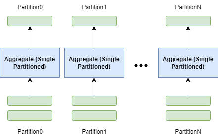
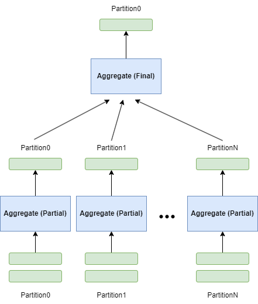
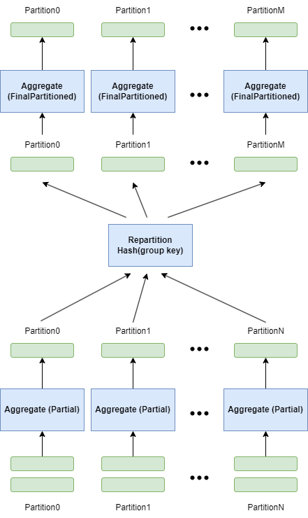

+++
title = "DataFusion 两阶段并行哈希分组聚合"
date = 2024-08-23
draft = true
+++

分组聚合功能是任何分析引擎的核心功能，可在海量数据上创建出可以理解的摘要。DataFusion 分析引擎采用了先进的两阶段并行哈希分组聚合技术，高度并行且向量化执行。

## 多种聚合方案
DataFusion 支持多种聚合方案，在不同情况下会选择最优方案。

### 一阶段无哈希分组（Single）

- Aggregate 算子接收所有输入数据串行执行
- 一个 Aggregate 算子完成所有分组聚合工作

### 一阶段有哈希分组（SinglePartitioned）

- 输入必须按照 group key 进行了 repartition
- 一个 Aggregate 算子完成所有分组聚合工作
- Aggregate 算子接收多个 partition 数据并行执行

### 两阶段无哈希分组（Partial-Final）

- 第一阶段 Aggregate 算子接收多个 partition 数据并行执行，计算中间聚合结果
- 第二阶段 Aggregate 算子接收所有中间聚合结果数据串行执行，生成最终聚合结果

### 两阶段有哈希分组（Partial-FinalPartioned）

- 第二阶段输入必须按照 group key 进行了 repartition
- 第一阶段 Aggregate 算子接收多个 partition 数据并行执行，计算中间聚合结果
- 第二阶段 Aggregate 算子接收多个 partition 中间聚合结果数据并行执行，并行生成最终聚合结果

### 方案选择策略
1. 在生成物理计划期间，如果 group by 为空或者用户设置并行度为 1，则选择 Partial-Final 方案，否则选择 Partial-FinalPartitioned 方案
2. 在优化物理计划期间，

## 两阶段并行哈希分组聚合

三种情况
1. no group
2. group + limit => topk
3. group

问题：
1. 如何向量化执行的
2. 内部hash表结构
3. Final 和 FinalPartitioned
4. 何时使用两阶段、何时使用一阶段

参考
1. https://arrow.apache.org/blog/2023/08/05/datafusion_fast_grouping/