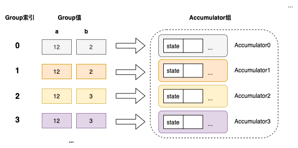
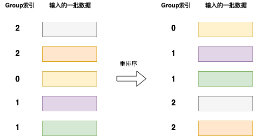
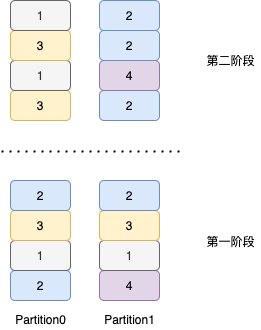
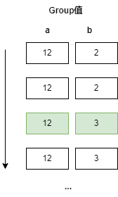

+++
title = "DataFusion 查询引擎两阶段并行哈希分组聚合"
date = 2024-08-23
+++

分组聚合功能是任何分析引擎的核心功能，可在海量数据上创建出可以理解的摘要。DataFusion 分析引擎采用了先进的两阶段并行哈希分组聚合技术，高度并行且向量化执行。

## 多种聚合方案
DataFusion 支持多种聚合方案，在不同情况下会选择最优方案。

### 一阶段无哈希分区（Single）

- Aggregate 算子接收所有输入数据串行执行
- 一个 Aggregate 算子完成所有分组聚合工作
- 场景：通常输入只有一个分区

### 一阶段有哈希分区（SinglePartitioned）

- 输入必须按照 group keys 进行了重新分区（repartition）
- 一个 Aggregate 算子完成所有分组聚合工作
- Aggregate 算子接收多个分区数据并行执行
- 场景：通常输入有多个分区，且都已经按 group keys 重新分区了

### 两阶段无哈希分区（Partial-Final）

- 第一阶段 Aggregate 算子接收多个分区数据并行执行，计算中间聚合结果
- 第二阶段 Aggregate 算子接收所有分区中间聚合结果数据串行执行，生成最终聚合结果
- 场景：通常输入有多个分区，查询没有 group by 语句 或者 用户设置并行度为 1（输出一个分区）

### 两阶段有哈希分区（Partial-FinalPartioned）

- 第一阶段 Aggregate 算子接收多个分区数据并行执行，计算中间聚合结果
- 第二阶段 Aggregate 算子接收多个分区中间聚合结果数据并行执行，并行生成最终聚合结果
- 第二阶段输入必须按照 group key 进行了重新分区
- 场景：通常输入有多个分区（没有按 group keys 重新分区），查询有 group by 语句，且并行度大于 1

## 两阶段并行哈希分组聚合（Partial-FinalPartioned）

以 `select a, b, avg(c) from t group by a, b` 为例。

### 第一阶段（Partial）

1. 不断从输入读取一批一批数据 `(a, b, c)`
2. 执行表达式求值和中间聚合计算，在内存中维护 group 值到中间聚合结果 `(a, b) -> (count(c), sum(c))` 的哈希表
3. 如果输入已按照 group keys 排序，则利用排序特性，提前输出部分已聚合完毕 group 的中间聚合结果到第二阶段（可以清空这部分内存）
4. 如果发现内存不足，则提前输出（early emit）内存中所有的已计算的中间聚合结果到第二阶段，清空内存中的哈希表
5. 如果发现是高基数聚合，则跳过聚合计算（不维护哈希表），将每行输入直接转换为中间聚合结果表达形式，输出到第二阶段

### 第二阶段（FinalPartitioned）

1. 不断从输入读取一批一批中间聚合数据 `(a, b, count(c), sum(c))`
2. 将相同 group 的中间聚合结果合并，在内存中维护 group 值到中间聚合结果 `(a, b) -> (count(c), sum(c))` 的哈希表
3. 如果输入已按照 group keys 排序，则利用排序特性，提前输出部分已聚合完毕的 group，会基于中间聚合结果计算最终聚合结果 `avg(c)`，然后输出到下一算子（可以清空这部分内存）
4. 如果内存不足，则将内存中的哈希表溢出到磁盘（spill），溢出前会先按照 group keys 排好序，以 Arrow IPC 格式写入磁盘文件，然后清空内存哈希表，最后会将多个溢出文件以流的形式执行合并操作（stream merge），计算最终聚合结果 `avg(c)` 并输出到下一算子
5. 如果内存充足，则最后将整个内存中的哈希表，计算最终聚合结果 `avg(c)` 并输出到下一算子

### 内存中的哈希表

以上在逻辑上形成一个哈希表，group 索引、group 值和 `Accumulator` 一一对应，但物理上并非直接使用哈希表存储 group 到聚合状态的映射，实际上哈希表维护的是 group 值到 group 索引的映射，哈希表负责分配 group 索引，而另外有一个 `Accumulator组` 的数据结构通过类似 Vec 的结构存储每个 group 的聚合状态，每个 group 索引会对应其中一个 Accumulator。

在接收一批数据时，先由哈希表来计算这批数据每行对应的 group 索引（可能是已存在的，也可能会分配一个新的），然后将这批数据和每行对应的 group 索引发送给 `Accumulator组` 来进行聚合状态更新。

`Accumulator组` 在更新前会利用 Arrow 计算内核对数据进行一个高效地重排，以便在更新聚合状态时，可以被编译器很好地向量化（SIMD加速）。

利用类似 `Vec` 连续内存存储，尽可能减少内存分配，尽可能类型特化，可以最大化提高聚合计算效率。

### group 在分区上的分布

在第一阶段，每个分区上都可能存在任意的 group，在进入第二阶段前，会按照 group keys 进行重新分区，因此在第二阶段，每个分区上的 group 不会存在重叠。

### 利用输入的排序特性
DataFusion 会利用聚合算子的输入在 group keys 上的（部分/完全）排序特性，来加速聚合计算。

假如聚合算子输入按照 group keys `a` 和 `b` 完全排序，

当出现新的 group 值时，说明前面的 group 已经聚合完毕，不会再有新的行出现，此时我们可以将前面 group 聚合计算结果提前发送到下一阶段算子。

### 高基数聚合跳过第一阶段

当出现高基数聚合（group 比较分散，默认阈值是行数大于 100000 并且 group 数量与行数比值大于 0.8）时，这时第一阶段在内存中需要维护巨大的哈希表，不仅浪费内存，而且第一阶段并不能显著减少数据量，此时会跳过第一阶段内的聚合计算，每行数据 `(a, b, c)` 直接被转换为中间聚合结果形式 `(a, b, count(c), sum(c))`，然后输出到第二阶段。

### TopK 聚合
当查询（`... order by xxx limit xxx`）满足特定条件时，[优化规则](https://github.com/apache/datafusion/blob/a4445283dbff1b74a6b4d9ecfa1016857dc6207e/datafusion/core/src/physical_optimizer/topk_aggregation.rs)会将 limit 下推到 Aggregate 算子，在执行时会直接走 TopK 聚合计算，采用一种 [Map 和优先队列的组合结构](https://github.com/apache/datafusion/blob/a4445283dbff1b74a6b4d9ecfa1016857dc6207e/datafusion/physical-plan/src/aggregates/topk/priority_map.rs)，避免在内存中维护巨大的哈希表，减少内存占用以及计算量。

### 其他一些问题

**第一阶段判断是否跳过聚合计算时，为什么需要输入无任何在 group keys 上的排序特性？**

因为如果输入具有排序特性，那么可以利用排序特性来提前输出部分已聚合完毕的 group，这样不会因为高基数聚合导致需要在内存中维护巨大的哈希表。

**为什么 Spill（溢出到磁盘）仅发生在第二阶段（FinalPartitioned），而不会在第一阶段（Partial）发生？**

Spill 是一个耗时的操作，涉及到磁盘 IO 和排序，而且对于高基数聚合（group 非常分散），很可能在第二阶段仍需要 Spill。所以通常的做法是在第一阶段内存不足时将内存中数据提前输出到第二阶段（early emit），在第二阶段内存不足时采用 Spill 溢出到磁盘。

**为什么 Spill（溢出到磁盘）之前需要对数据按照 group keys 进行排序？**

如果发生 Spill，说明数据量过大内存不足，无法在内存中对数据进行分组，唯一的方式就是进行流式地 `读取-聚合-输出`。所以我们提前对 Spill 到磁盘的数据进行排序，在流式读取所有磁盘文件时执行合并（stream merge），利用输入的完全排序特性，可以流式地输出一组组聚合结果。

参考资料
1. [Aggregating Millions of Groups Fast in Apache Arrow DataFusion](https://arrow.apache.org/blog/2023/08/05/datafusion_fast_grouping/)