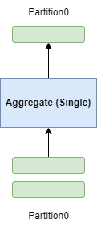

+++
title = "DataFusion 两阶段并行哈希分组聚合"
date = 2024-08-23
draft = true
+++

分组聚合功能是任何分析引擎的核心功能，可在海量数据上创建出可以理解的摘要。DataFusion 分析引擎采用了先进的两阶段并行哈希分组聚合技术，高度并行且向量化执行。

## 多种聚合方案
DataFusion 支持多种聚合方案，在不同情况下会选择最优方案。

### 一阶段无哈希分区（Single）

- Aggregate 算子接收所有输入数据串行执行
- 一个 Aggregate 算子完成所有分组聚合工作
- 场景：通常输入只有一个 partition

### 一阶段有哈希分区（SinglePartitioned）

- 输入必须按照 group key 进行了重新分区 
- 一个 Aggregate 算子完成所有分组聚合工作
- Aggregate 算子接收多个 partition 数据并行执行
- 场景：通常输入有多个 partitions，且都已经按 group key 重新分区（repartition）了

### 两阶段无哈希分区（Partial-Final）

- 第一阶段 Aggregate 算子接收多个 partition 数据并行执行，计算中间聚合结果
- 第二阶段 Aggregate 算子接收所有中间聚合结果数据串行执行，生成最终聚合结果
- 场景：通常输入有多个 partitions，查询没有 group by 语句 或者 用户设置并行度为 1（输出一个 partition）

### 两阶段有哈希分区（Partial-FinalPartioned）

- 第一阶段 Aggregate 算子接收多个 partition 数据并行执行，计算中间聚合结果
- 第二阶段 Aggregate 算子接收多个 partition 中间聚合结果数据并行执行，并行生成最终聚合结果
- 第二阶段输入必须按照 group key 进行了重新分区（repartition）
- 场景：通常输入有多个 partitions（没有按 group key 重新分区），查询有 group by 语句，且并行度大于 1

## 两阶段并行哈希分组聚合（Partial-FinalPartioned）

以 `select a, b, avg(c) from t group by a, b` 为例。

### 第一阶段（Partial）

1. 从输入读取一批数据 `(a, b, c)`
2. 求值 group keys `a` 和 `b` 和 聚合函数入参 `c`
3. 基于分组和聚合函数执行聚合计算（并非计算最终 `avg` 结果，而是计算中间结果 `count(c)` 和 `sum(c)`）
4. 计算是否为高基数聚合（group 非常分散，默认阈值是行数大于 100000 并且 group 数量与行数比值大于 0.8）
5. 判断是否可以输出部分中间聚合结果（如果输入已按照 group keys 排好序，则可以预见后续输入不会再出现同一 group 值，此时可以将该 group 输出）
    1. 停止读取输入数据，改为输出部分中间聚合结果
    2. 输出完毕后，继续读取输入数据（跳到第 1 步）
6. 如果内存已经不足，则提前输出（early emit）中间聚合结果，输出完毕后，继续读取输入数据（跳到第 1 步）
7. 判断是否跳过聚合计算（基于第 4 步结果），如果跳过
    1. 停止读取输入数据，改为输出已经聚合的全部中间结果
    2. 读取输入数据，不做聚合计算直接将输入转换为中间结果 `(a, b, count(c), sum(c))` 输出，直至输入完毕，随即此阶段完成
8. 继续第 1 步，直至输入完毕，然后输出所有中间结果，随即此阶段完成

### 第二阶段（FinalPartitioned）

1. 从输入读取一批中间聚合数据 `(a, b, count(c), sum(c))`
2. 判断分配的内存是否还有空间，如果没有则溢出到磁盘
   1. 将内存中所有中间聚合数据按照 group keys 升序排序 `[a asc, b asc]`
   2. 以 Arrow IPC 格式写入磁盘文件
3. 基于分组和聚合函数执行聚合计算（将中间聚合结果合并，此时仍为 `(a, b, count(c), sum(c))`）
4. 判断是否可以输出部分最终聚合结果（如果输入已按照 group keys 排好序，则可以预见后续输入不会再出现同一 group 值，此时可以将该 group 输出）
    1. 停止读取输入数据，改为输出部分最终聚合结果 `(a, b, avg(c))`
    2. 输出完毕后，继续读取输入数据（跳到第 1 步）
5. 继续第 1 步，直至输入完毕
    1. 如果没有溢出到磁盘，则直接输出内存中的所有结果 `(a, b, avg(c))`，随即此阶段完成
    2. 如果有溢出到磁盘
        1. 读取内存中的结果，并按照 group keys 升序排序 `[a asc, b asc]`，生成一个流
        2. 读取所有溢出到磁盘的文件，每个文件生成一个流
        3. 所有流均按照 group keys 完全排序，合并一起执行 stream merge
        4. 不断读取每个流数据，基于分组和聚合函数执行聚合计算（将中间聚合结果合并，此时仍为 `(a, b, count(c), sum(c))`）
        5. 判断是否可以输出部分最终聚合结果（如果输入已按照 group keys 排好序，则可以预见后续输入不会再出现同一 group 值，此时可以将该 group 输出）
            1. 停止读取输入数据，改为输出部分最终聚合结果 `(a, b, avg(c))`
            2. 输出完毕后，继续读取输入数据
        6. 直至输入数据读取完毕，然后输出所有剩余结果，随即此阶段完成

### 利用输入的排序特性
DataFusion 会利用聚合算子输入在 group keys 上的（部分/完全）排序特性，来加速聚合计算。

假如聚合算子输入按照 group keys `a` 和 `b` 完全排序，

当出现新的 group 值时，说明前面的 group 已经聚合完毕，不会再有新的行出现，此时我们可以将前面 group 聚合计算结果发送到下一阶段算子。

### 跳过第一阶段聚合

TODO

### TopK 聚合
当查询（`... order by xxx limit xxx`）满足特定条件时，[优化规则](https://github.com/apache/datafusion/blob/a4445283dbff1b74a6b4d9ecfa1016857dc6207e/datafusion/core/src/physical_optimizer/topk_aggregation.rs)会将 limit 下推到 Aggregate 算子，在执行时会直接走 TopK 聚合计算，采用一种[Map和优先队列的组合结构](https://github.com/apache/datafusion/blob/a4445283dbff1b74a6b4d9ecfa1016857dc6207e/datafusion/physical-plan/src/aggregates/topk/priority_map.rs)，避免在内存中维护巨大的哈希表，减少内存占用以及计算量。

### 其他一些问题

**为什么 Spill（溢出到磁盘）仅发生在第二阶段（FinalPartitioned），而不会在第一阶段（Partial）发生？**

Spill 是一个耗时的操作，涉及到磁盘 IO 和排序，而且对于高基数聚合（group 非常分散），很可能在第二阶段仍需要 Spill。所以通常的做法是在第一阶段内存不足时将内存中数据提前输出到第二阶段（early emit），在第二阶段内存不足时采用 Spill 溢出到磁盘。

**为什么 Spill（溢出到磁盘）之前需要对数据按照 group keys 进行排序？**

如果发生 Spill，说明数据量过大内存不足，无法在内存中对数据进行分组，唯一的方式就是进行流式地 `读取-聚合-输出`。所以我们提前对 Spill 到磁盘的数据进行排序，在流式读取所有磁盘文件时执行合并（stream merge），利用完全排序特性，可以流式地输出一组组聚合结果。

**第一阶段判断是否跳过聚合直接输出中间聚合结果时，为什么需要输入无任何 group keys 的排序特性？**

TODO

问题：
1. 如何向量化执行的
2. 内部hash表结构
4. 如果是 full group ordering，但还没到 new group value出现时，spill到了磁盘，后续 group_ordering.emit_to() 如何保证正确性？

参考资料
1. [Aggregating Millions of Groups Fast in Apache Arrow DataFusion](https://arrow.apache.org/blog/2023/08/05/datafusion_fast_grouping/)