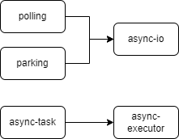

+++
title = "smol 异步运行时剖析"
date = 2024-09-12
draft = true
+++

[smol] 是一个微型且快速的 Rust 异步运行时，它由许多微型的 crate 组成（比如 polling / async-io / async-executor 等），每个 crate 相对独立，非常适合学习 Rust 异步运行时是如何一步步构建的。

## crates 概览


- [polling]: 提供一个在 epoll / kqueue / iocp 等之上的统一接口
- [async-lock]: 提供异步环境基本的同步原语，包含 Mutex / RwLock 等
- [async-task]: TODO 123
- [async-io]: TODO 123
- [async-executor]: TODO 123

注：省略了一些非核心 crate，比如异步文件系统原语的 async-fs、异步网络的 async-net 等（对标准库实现的异步封装），以及 smol（它只是对众多 crates 的重新导出而已）。

## polling

polling 对 epoll / kqueue / iocp 等各平台的 IO 多路复用机制进行了一个统一的抽象，方便跨平台使用。

它提供了一个 `Poller` 结构体，封装了各平台的 IO 多路复用机制（例如 Linux 下则包含 [epoll_create1] 返回的文件描述符），并主要提供了三个方法
1. 增删改感兴趣的 IO 事件（参考 [epoll_ctl](https://man7.org/linux/man-pages/man2/epoll_ctl.2.html)）
2. 阻塞等待新的 IO 事件（参考 [epoll_wait]）
3. 唤醒正在阻塞等待中的 `Poller`

以 Linux 下 epoll 为例分析其细节，
1. 创建 Poller 时，调用 [epoll_create1] 创建一个新的 epoll 实例并保存其返回的文件描述符，调用 [eventfd](https://man7.org/linux/man-pages/man2/eventfd.2.html) 创建用于通知（唤醒）的对象 notifier 并注册到 epoll 列表中，调用 [timerfd_create](https://man7.org/linux/man-pages/man2/timerfd_create.2.html) 创建一个定时器并将其注册到 epoll 列表中
2. 增删改感兴趣的 IO 事件时，传入其所属的文件描述符（例如 socket），关联数据（当返回 IO 事件时携带），以及一些标志位（比如只监听可读或可写事件）
3. 阻塞等待新的 IO 事件时，可传入超时时间，当有新的 IO 事件（一个或多个） / 中断 / 超时，结束阻塞返回。这里并没有使用 [epoll_wait] 本身的超时机制，而是使用更为精确的定时器，在调用 [epoll_wait] 前会通过 [timerfd_settime](https://man7.org/linux/man-pages/man2/timerfd_settime.2.html) 设置定时器超时时间，当超时时间到达时，会在 timer 文件描述符上产生一个新的 IO 事件来结束阻塞
4. 唤醒正在阻塞等待中的 `Poller` 时，通过调用 [write](https://man7.org/linux/man-pages/man2/write.2.html) 往 notifier 文件描述符上写入数据来触发一个新的 IO 事件来结束阻塞

具体例子
```rust
// 创建一个 socket
let socket = TcpListener::bind("127.0.0.1:8000")?;
socket.set_nonblocking(true)?;

// 指定 socket 标识符（epoll 返回新的 IO 事件时会携带）
let key = 7;

// 创建一个 epoll 实例，并执行初始化工作（注册 notifier 和 timer 到 epoll 列表中）
let poller = Poller::new()?;

// 将 socket 添加到 epoll 队列中，监听其可读事件
unsafe {
    poller.add(&socket, Event::readable(key))?;
}

let mut events = Events::new();
loop {
    events.clear();

    // 阻塞等待新的 IO 事件（这里并未传入超时时间）
    poller.wait(&mut events, None)?;

    for ev in events.iter() {
        // 如果发现 socket 可读事件，则执行下一步操作
        if ev.key == key {
            socket.accept()?;
            // 继续监听 socket 可读事件
            poller.modify(&socket, Event::readable(key))?;
        }
    }
}

// 在 socket drop 前必须要将其从 epoll 列表中移除
poller.delete(&socket)?;
```

[smol]: https://github.com/smol-rs/smol
[polling]: https://github.com/smol-rs/polling
[async-lock]: https://github.com/smol-rs/async-lock
[async-task]: https://github.com/smol-rs/async-task
[async-io]: https://github.com/smol-rs/async-io
[async-executor]: https://github.com/smol-rs/async-executor
[epoll_create1]: https://man7.org/linux/man-pages/man2/epoll_create.2.html
[epoll_wait]: https://man7.org/linux/man-pages/man2/epoll_wait.2.html