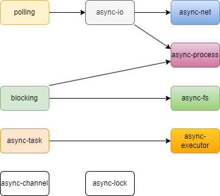
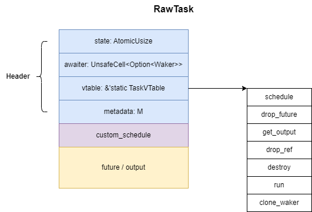

+++
title = "Rust 异步运行时 smol 剖析"
date = 2024-12-09
+++

[smol] 是一个小型且快速的 Rust 异步运行时，它由许多小型的 crate 组成（比如 polling / async-io / async-executor 等），每个 crate 相对独立，非常适合学习 Rust 异步运行时是如何一步步构建的。

## crates 概览


- [polling]: 提供一个在 epoll / kqueue / iocp 等之上的统一接口
- [async-io]: 实现 reactor 和 driver 底层机制并对外提供 Async 和 Timer 两个工具来实现异步 IO 和定时器
- [async-net]: 基于 async-io 库提供的 Async 工具来将标准库的同步 IO 转变成异步 IO
- [async-task]: 提供异步任务的抽象封装，便于构建自己的 executor
- [async-executor]: 提供了一个简单的 executor

注：学习以上 crates 即可了解异步运行时从底层到上层的原理。省略了许多不重要的 crates，比如异步文件系统原语的 async-fs（使用线程池跑同步的文件操作来实现异步）、异步网络的 async-net 等（基于 async-io 的 Async 工具对标准库的封装），以及 smol（它只是对众多 crates 的重新导出而已）等等。

## polling

polling 对 epoll / kqueue / iocp 等各平台的 IO 多路复用机制进行了一个统一的抽象，方便跨平台使用。

它提供了一个 `Poller` 结构体，封装了各平台的 IO 多路复用机制（例如 Linux 下则包含 [epoll_create1] 返回的文件描述符），并主要提供了三个方法
1. 增删改感兴趣的 IO 事件（参考 [epoll_ctl](https://man7.org/linux/man-pages/man2/epoll_ctl.2.html)）
2. 阻塞等待新的 IO 事件（参考 [epoll_wait]）
3. 唤醒正在阻塞等待中的自身

以 Linux 下 epoll 为例分析其细节，
1. 创建 Poller 时，调用 [epoll_create1] 创建一个新的 epoll 实例并保存其返回的文件描述符，调用 [eventfd](https://man7.org/linux/man-pages/man2/eventfd.2.html) 创建用于通知（唤醒）的对象 notifier 并注册到 epoll 列表中，调用 [timerfd_create](https://man7.org/linux/man-pages/man2/timerfd_create.2.html) 创建一个定时器并将其注册到 epoll 列表中
2. 增删改感兴趣的 IO 事件时，传入其所属的文件描述符（例如 socket），关联数据（当返回 IO 事件时携带），以及一些标志位（比如只监听可读或可写事件）
3. 阻塞等待新的 IO 事件时，可传入超时时间，当有新的 IO 事件（一个或多个） / 中断 / 超时，结束阻塞返回。这里并没有使用 [epoll_wait] 本身的超时机制，而是使用更为精确的定时器，在调用 [epoll_wait] 前会通过 [timerfd_settime](https://man7.org/linux/man-pages/man2/timerfd_settime.2.html) 设置定时器超时时间，当超时时间到达时，会在 timer 文件描述符上产生一个新的 IO 事件来结束阻塞
4. 唤醒正在阻塞等待中的自身时，通过调用 [write](https://man7.org/linux/man-pages/man2/write.2.html) 往 notifier 文件描述符上写入数据来触发一个新的 IO 事件来结束阻塞

具体例子
```rust
// 创建一个 socket
let socket = TcpListener::bind("127.0.0.1:8000")?;
socket.set_nonblocking(true)?;

// 指定 socket 标识符（epoll 返回新的 IO 事件时会携带）
let key = 7;

// 创建一个 epoll 实例，并执行初始化工作（注册 notifier 和 timer 到 epoll 列表中）
let poller = Poller::new()?;

// 将 socket 添加到 epoll 队列中，监听其可读事件
unsafe {
    poller.add(&socket, Event::readable(key))?;
}

let mut events = Events::new();
loop {
    events.clear();

    // 阻塞等待新的 IO 事件（这里并未传入超时时间）
    poller.wait(&mut events, None)?;

    for ev in events.iter() {
        // 如果发现 socket 可读事件，则执行下一步操作
        if ev.key == key {
            socket.accept()?;
            // 继续监听 socket 可读事件
            poller.modify(&socket, Event::readable(key))?;
        }
    }
}

// 在 socket drop 前必须要将其从 epoll 列表中移除
poller.delete(&socket)?;
```

## async-io

async-io 提供了一个全局唯一的 Reactor 实例来支持对定时器 Timer 和 IO 对象的事件监听，它利用了 polling 提供的 IO 多路复用抽象。Reactor 并不会主动去轮询监听新事件，而是需要一个 Driver 来进行驱动，Driver 实际上就是一个独立的 OS 线程，它会一直循环不断的驱动 Reactor。

在 Reactor 之上提供了两个面向用户的工具：
- Async：用于构建异步 IO 的适配器，用户使用它来包装同步 IO 类型（如 `std::net::TcpStream`），然后提供异步的 IO 读写能力
- Timer: 用户可以创建一个 Timer 来周期性的发出事件，Timer 实现了 `Future` 和 `Stream` trait，用户可以对它进行 `poll` 或 `poll_next`

**Reactor**

Reactor 提供了 `insert_io` / `remove_io` / `insert_timer` / `remove_timer` 方法来向 Reactor （取消）注册 IO 对象或者定时器，对于 IO 对象，会（取消）注册到底层 OS 的 IO 多路复用机制上（如 epoll）。

Reactor 的核心是 `fn react(&mut self, timeout: Option<Duration>) -> io::Result<()>` 方法，它会阻塞线程直到有新的 IO / timer 事件（如果传入了超时时间则可能超时返回），当收到新的事件后，通过 poll future 传递下来的 waker 来进行唤醒。它通过 Mutex 被限制为只能有一个线程来执行，无法并发执行。

Reactor 通过 tick 机制来保证 IO 事件是否是“新鲜的”，在每轮 `react` 方法执行期间，tick 值都会自增 1。

**Driver**

Driver 是一个单独的 OS 线程，在 Reactor 初始化时一并创建。它不断循环的去尝试获取 Reactor 锁并执行其 `react` 方法，然后 `react` 方法会阻塞 Driver 线程直至有新的 timer / IO 事件产生。

**Async**
```rust
async fn my_server() -> std::io::Result<()> {
    let listener: Async<TcpListener> = Async::new(TcpListener::bind("127.0.0.1:8080")?)?;
    loop {
        let (_stream, addr) = listener.read_with(|io: &TcpListener| io.accept()).await?;
        println!("Accepted connection from: {}", addr);
    }
}
```
以上示例创建了一个同步的 TcpListener 并用 Async 包装起来，然后就可以执行异步的 IO 操作。其原理是在 poll 时，会向 Reactor 传递 waker，等到有新的 IO 事件时，Reactor 再通过 waker 进行通知，然后再执行 TcpListener 的 accept 同步方法，此时执行 accept 不会阻塞，而是能里立刻返回。

## async-task

async-task 提供了异步任务的抽象封装，异步任务 RawTask 包含 future 以及 future 运行时所需的内容，基于 RawTask 对外提供了两个安全的封装 Runnable 和 Task。Runnable 主要给上层 Executor 使用，Task 主要面向用户使用。



RawTask 包含：
- state: 任务状态
- awaiter: 用户 await Task 时注册的 waker
- vtable: 指向一个静态变量，包含各种函数指针
  - schedule: 实际会调用 custom_schedule
  - drop_future: 析构 future
  - get_output: 读取 future 结果
  - drop_ref: 减少任务引用计数，当引用计数归零时，调用 destroy 销毁任务
  - destroy: 清理任务的资源和内存
  - run: 执行异步任务
  - clone_waker: 克隆一个新的 waker
- metadata: Executor 传入的自定义数据
- custom_schedule: Executor 传入的调度方法
- future / output: 一块 union 区域，存放 future 或者其结果 output

任务主要有以下状态：
1. scheduled: 即将被调度执行
2. running: 正在执行 poll
3. completed: 任务完成（output 还没被读取）
4. closed: 任务关闭（任务被取消或者 output 已被读取）

**创建异步任务**

创建异步任务 `fn spawn<F, S>(future: F, schedule: S) -> (Runnable, Task<F::Output>)` 需要传入 future 和 custom_schedule 方法，任务初始状态为 scheduled，返回 Runnable 和 Task。

**Runnable**
- schedule 方法：用于让 Executor 调度该任务，此方法仅调用 custom_schedule 方法，无其他行为
- run 方法：实际调用 RawTask::run 方法，用于让 Executor 对任务执行 poll 操作，如果任务执行完毕，则将状态改为 completed。如果任务是 closed 状态，会执行资源清理动作

**Task**
- poll_task 方法：如果任务未完成，则注册 waker 并返回 Poll::Pending；如果任务完成了，则读取 output 并将任务置为 closed
- cancel 方法：通过将任务置为 closed，会重新发起一次调度，在执行任务过程中进行后续资源清理动作

**Waker**: 异步任务内部管理的用于传递给 Reactor 的 waker，当 IO 源 ready 时唤醒异步任务并触发一次调度
- clone_waker: 调用 RawWaker::clone_waker 克隆一个新的 waker
- wake: 通过将任务设置为 scheduled 状态并触发一次调度，清理 waker 关联资源
- wake_by_ref: 通过将任务设置为 scheduled 状态并触发一次调度
- drop_waker: 减少任务引用计数

**Awaiter**：用户 await Task 时传入的 waker，当异步任务完成时唤醒 Executor 再次 poll 获取 future 结果

## async-executor

async-executor 提供了两个简单的 executor 用于执行用户异步任务。
- Executor：实现了 Send + Sync，支持多线程，spawn 方法限制 future 需要实现 Send
- LocalExecutor：对 Executor 的包装，未实现 Send + Sync，限定单线程，spawn 方法不需要 future 实现 Send

使用 Executor 实现一个多线程异步运行时
```rust
fn main() {
    let ex = Executor::new();

    thread::scope(|scope| {
        for _ in 0..5 {
            scope.spawn(|| block_on(ex.run(core::future::pending::<()>())));
        }
        block_on(async {
            let listener = TcpListener::bind("127.0.0.1:8080").await.unwrap();
            loop {
                let (stream, addr) = listener.accept().await.unwrap();
                println!("Accepted connection from: {}", addr);
                let task = ex.spawn(handle_new_connection(stream, addr));
                task.detach();
            }
        })
    })
}

async fn handle_new_connection(_stream: TcpStream, addr: SocketAddr) {
    Timer::after(Duration::from_secs(10)).await;
    println!(
        "[{:?}] Handle connection from: {}",
        thread::current().id(),
        addr
    );
}

// 类似于 tokio 以下代码
#[tokio::main]
async fn main() {
    let listener = TcpListener::bind("127.0.0.1:8080").await.unwrap();

    loop {
        let (stream, addr) = listener.accept().await.unwrap();
        tokio::spawn(async move {
            handle_new_connection(stream, addr).await;
        });
    }
}
```


[smol]: https://github.com/smol-rs/smol
[polling]: https://github.com/smol-rs/polling
[parking]: https://github.com/smol-rs/parking
[async-lock]: https://github.com/smol-rs/async-lock
[async-task]: https://github.com/smol-rs/async-task
[async-io]: https://github.com/smol-rs/async-io
[async-executor]: https://github.com/smol-rs/async-executor
[async-net]: https://github.com/smol-rs/async-net
[epoll_create1]: https://man7.org/linux/man-pages/man2/epoll_create.2.html
[epoll_wait]: https://man7.org/linux/man-pages/man2/epoll_wait.2.html