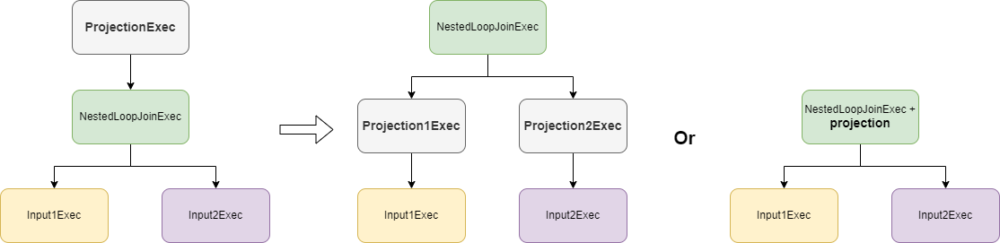

+++
title = "DataFusion 查询引擎 Nested Loop Join"
date = 2025-01-06
+++

Nested Loop Join 是最通用的一种 join 实现，原理简单，实现容易。

## 场景
主要用于 On 子句中没有等值条件的 Join 运算。
例如：表 `t0(a int, b int)` 和 `t1(c int, d int)`
1. `select * from t0 join t1 on t0.a > t1.c` 有 On 条件但非等值条件，走 Nested Loop Join 算子
2. `select * from t0 join t1` 没有任何条件且是 inner join，走 Cross Join 算子
3. `select * from t0 left join t1` 没有任何条件，非 inner join，走 Nested Loop Join 算子
4. `select * from t0 join t1 on t0.a > t1.c and t0.b = t1.d` 有 On 条件且其中包含等值条件，走 Hash Join 或 Sort Merge Join 算子（根据用户配置）

## 优化
Nested Loop Join 会参与两个物理阶段优化
1. projection push down：优化器会尝试将 projection 下推到 Nested Loop Join 算子的输入

2. join selection：优化器会根据 join 两边输入的统计信息，将小表放到左侧，大表放到右侧

## 执行
### 第一阶段：build 阶段
读取左表数据所有 partition 的数据到内存中，被所有线程共享。

### 第二阶段：probe 阶段
probe 阶段是分 partition 并行执行的，每个线程不断读取对应 partition 的右表数据，与左表数据进行 join。

以如下数据为例，SQL 为 `select t0.a, t1.c from t0 full join t1 on t0.a > t1.c`

第一步，先构建 cross join 连接下的行索引

|left_indices | right_indices |
|-------------|---------------|
|0|0|
|1|0|
|2|0|
|0|1|
|1|1|
|2|1|
|0|2|
|1|2|
|2|2|

第二步，应用 On 条件过滤行索引

|left_indices | right_indices |
|-------------|---------------|
|0|0|
|1|0|
|1|2|

第三步，根据 join 类型调整行索引
1. 如果是 inner join，则不调整
2. 如果是 left join，在第三阶段输出未匹配的左表数据
3. 如果是 right join，则追加右表未匹配的行

|left_indices | right_indices |
|-------------|---------------|
|0|0|
|1|0|
|1|2|
|NULL|1|

4. 如果是 full join，跟 right join 类似，不过还会在第三阶段输出未匹配的左表数据

第四步，根据行索引结合 projection 输出 join 结果。例如 full join，会输出

|t0.a | t1.c |
|-----|------|
|5|2|
|9|2|
|9|6|
|NULL|10|

### 第三阶段：输出左表未匹配的行

构建行索引（左表第 0 和 第 1 行已匹配，还剩第 2 行未匹配）

|left_indices | right_indices |
|-------------|---------------|
|2|NULL|

根据行索引结合 projection 输出 join 结果

|t0.a | t1.c |
|-----|------|
|1|NULL|

所以 `select t0.a, t1.c from t0 full join t1 on t0.a > t1.c` 的最终执行结果是

|t0.a | t1.c |
|-----|------|
|5|2|
|9|2|
|9|6|
|NULL|10|
|1|NULL|