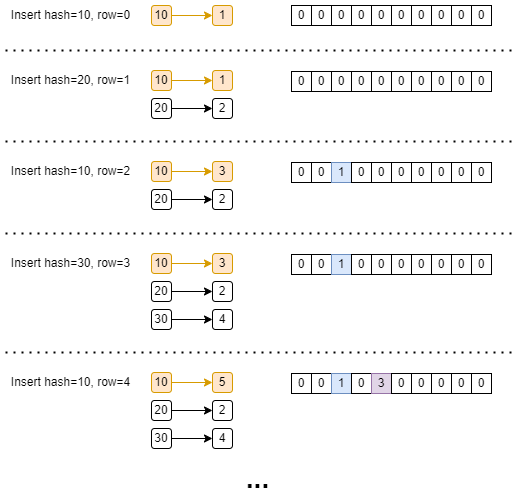

+++
title = "DataFusion 查询引擎 Hash Join"
date = 2025-01-13
+++

对于含有等值连接条件的 Join，可以采用 Hash Join 方式进行加速计算，它利用了哈希表的查询特性，其本身也可以更好的并行化。

## 场景
主要用于 On 子句中含有等值连接条件的 Join 运算。例如默认用户配置下：表 `t0(a int, b int)` 和 `t1(c int, d int)`
1. `select * from t0 join t1 on t0.a = t1.c` 有一个 On 条件且是等值条件，走 Hash Join 算子
2. `select * from t0 join t1 on t0.a > t1.c` 有一个 On 条件但非等值条件，走 Nested Loop Join 算子
3. `select * from t0 join t1 on t0.a > t1.c and t0.b = t1.d` 有多个 On 条件且其中包含等值条件，走 Hash Join 算子
4. `select * from t0 join t1 on t0.a = t1.c or t0.b > t1.d` 有多个 On 条件且其中包含等值条件，但是是“或”的关系，走 Nested Loop Join 算子

## 执行模式
Hash Join 有两种执行模式：CollectLeft 和 Partitioned
- CollectLeft 模式更加通用，会先将左表数据全部读取出来构建哈希表（被所有线程共享），然后跟右表 join
- Partitioned 模式并行度更高，但要求左右表的 partition 数量相同并且分区方式都是以等值连接条件中的表达式进行哈希分区（例如 `on t0.a = t1.c`，左表需要按照 `t0.a` 进行哈希分区，右表需要按照 `t1.c` 进行哈希分区），它只需将左右表对应 partition 数据进行 join，无需构建一个全局的哈希表
    

**Partitioned 模式下左右表数据的分布**：左右表中具有相同 join keys（等值） 的行一定被分布到左右对应相同的 partition 中（例如左右表中 join key 值为 2 的行均被分布到各自的 1 号 partition 中）。

执行模式选择策略：
1. 当用户希望并行度为 1 时，会采用 CollectLeft 模式
2. 当用户不希望运行时收集统计数据时，默认走 Partitioned 模式
3. 通过统计数据来选择执行模式，如果左右表数据量至少有一个比较小，则走 CollectLeft 模式，否则走 Partitioned 模式

## 优化
Hash Join 主要参与以下优化
1. projection push down：优化器会尝试将 projection 下推到 Hash Join 算子的输入，如果无法下推，会尝试将 projection 嵌入到 Hash Join 算子中
    
2. enforce distribution
    - 对于 CollectLeft 模式，在左表上插入 Coalesce Partitions / Sort Preserving Merge 算子，将其所有 partition 合并成 1 个
    - 对于 Partitioned 模式，在左右表上插入 Repartition 算子，将其分区方式改成按等值连接条件哈希分区
3. join selection
    - 优化器会根据 join 两边输入的统计信息，将小表放到左侧，大表放到右侧
    - 如果左右输入均为无界且增量的（增量的意思是例如 filter 这种接收一批处理一批），则转换为 Symmetric Hash Join

## 执行

以 Partitioned 模式为例，SQL 为 `select * from t0 full join t1 on t0.a = t1.c and t0.b > t1.d`，左右表的每个 partition 都会经历如下阶段，以第 0 号 partition 为例

### 第一阶段：build 阶段

对左表的 partition0 所有数据构建哈希表，其中 key 为 `t0.a` 列值的哈希值，value 为行索引（这里会处理哈希冲突情况）。

例如左表 partition0 数据如下

| 行索引 | t0.a | t0.b |
|-------|------|------|
|0|3|1|
|1|6|0|
|2|4|5|

### 第二阶段：probe 阶段

probe 阶段不断读取右表 partition0 的数据，与左表 partition0 数据进行 join。

第一步，从右表读取一批数据，计算这一批数据 `t1.c` 列值的哈希值

例如右表这一批数据如下

| 行索引 | t1.c | t1.d |
|-------|------|------|
|0|2|6|
|1|4|2|
|2|3|3|

第二步，使用第一步中计算的哈希值，从 build 阶段构建的左表的哈希表中查找满足等值连接条件 `t0.a = t1.c` 的行索引，然后根据行索引来比较 `t0.a` 列与 `t1.c` 列是否真的相等

| 左表行索引 | 右表行索引 |
|-----------|-----------|
|0|2|
|2|1|

第三步，使用非等值连接条件 `t0.b > t1.d` 进行过滤

| 左表行索引 | 右表行索引 |
|-----------|-----------|
|2|1|

第四步，根据 join 类型调整行索引
1. 如果是 inner join，则不调整
2. 如果是 left join，在第三阶段输出未匹配的左表数据
3. 如果是 right join，则追加右表未匹配的行
4. 如果是 full join，跟 right join 类似，不过还会在第三阶段输出未匹配的左表数据

| 左表行索引 | 右表行索引 |
|-----------|-----------|
|2|1|
|NULL|0|
|NULL|2|

第五步，根据行索引结合 projection 输出 join 结果

| t0.a | t0.b | t1.c | t0.d |
|------|------|------|------|
|4|5|4|2|
|NULL|NULL|2|6|
|NULL|NULL|3|3|

### 第三阶段：输出左表未匹配的行

构建行索引（左表第 2 已匹配，还剩第 0 和第 1 行未匹配）

| 左表行索引 | 右表行索引 |
|-----------|-----------|
|0|NULL|
|1|NULL|

根据行索引结合 projection 输出 join 结果

| t0.a | t0.b | t1.c | t0.d |
|------|------|------|------|
|3|1|NULL|NULL|
|6|0|NULL|NULL|

所以整个 SQL 的最终执行结果是

| t0.a | t0.b | t1.c | t0.d |
|------|------|------|------|
|4|5|4|2|
|NULL|NULL|2|6|
|NULL|NULL|3|3|
|3|1|NULL|NULL|
|6|0|NULL|NULL|

## 哈希表设计

当前 DataFusion 采用的哈希表设计是基于 `hashbrown::RawTable` 和 `Vec<u64>`，自己计算哈希值和解决哈希冲突，`RawTable` 存放无冲突的哈希值到行索引映射，`Vec<u64>` 存放哈希冲突的映射。哈希表的内存是一次性分配好，后续不会扩容。

假设左表的数据共有 10 行，在建立哈希表时，会分配一个容量为 10 的 `RawTable` 和 `Vec<u64>`。

以下是插入过程。由于 0 被用作默认值，所以存放行索引时采用 +1 存储。当遇到哈希冲突时，会将原 `RawTable` 中的 value 存入到 `Vec<u64>` 中，放置到行索引指向的地方。

在检索时，例如查找 hash 值为 10 的所有行索引
1. 从 `RawTable` 中找到 key 为 10 的映射，即 `10 -> 5`
2. 使用上面拿到的 5（实际行索引为 4）从 `Vec<u64>` 拿到 `3`
3. 使用上面拿到的 3（实际行索引为 2）从 `Vec<u64>` 拿到 `1`
4. 使用上面拿到的 1（实际行索引为 0）从 `Vec<u64>` 拿到 `0`
5. 由于上面拿到的值为 0，停止检索
6. 最终检索到的结果是 `5, 3, 1`，因此实际行索引结果是 `4, 2, 0`

**保持输出顺序和输入顺序一致**

以上例子中输入的顺序是 `0, 2, 4`，而哈希检索结果中的顺序是 `4, 2, 0`。因此为了保持顺序一致，在构建哈希表时，DataFusion 会对输入数据进行翻转。