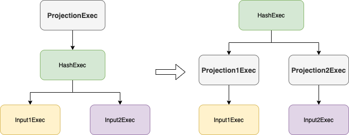

+++
title = "DataFusion 查询引擎 Hash Join"
date = 2025-01-13
draft = true
+++

对于含有等值条件的 Join，可以采用 Hash Join 方式进行加速计算，它利用了哈希表的查询特性，其本身也可以更好的并行化。

## 场景
主要用于 On 子句中含有等值条件的 Join 运算。例如默认用户配置下：表 `t0(a int, b int)` 和 `t1(c int, d int)`
1. `select * from t0 join t1 on t0.a = t1.c` 有一个 On 条件且是等值条件，走 Hash Join 算子
2. `select * from t0 join t1 on t0.a > t1.c` 有一个 On 条件但非等值条件，走 Nested Loop Join 算子
3. `select * from t0 join t1 on t0.a > t1.c and t0.b = t1.d` 有多个 On 条件且其中包含等值条件，走 Hash Join 算子

## 优化
Hash Join 主要参与以下优化
1. projection push down：优化器会尝试将 projection 下推到 Hash Join 算子的输入
2. enforce distribution：在左右表上插入 Repartition 算子，将分区方式改成按等值条件哈希分区
3. join selection
    - 优化器会根据 join 两边输入的统计信息，将小表放到左侧，大表放到右侧
    
    - 如果左右输入均为无界且增量的（接收一批处理一批），则转换为 Symmetric Hash Join

## 执行
Hash Join 有两种执行模式：CollectLeft 和 Partitioned
- CollectLeft 模式要求左表的 partition 数量为 1
- Partitioned 模式要求左右表的 partition 数量相同并且分区方式都是以等值条件中的表达式进行哈希分区，例如 `on t0.a = t1.c`，左表需要按照 `t0.a` 进行哈希分区，右表需要按照 `t1.c` 进行哈希分区

### 第一阶段：build 阶段

CollectLeft 模式会将左表所有 partition 读取出来构建哈希表，而 Partitioned 模式会对左表每个 partition 单独构建哈希表。

### 第二阶段：probe 阶段

probe 阶段是分 partition 并行执行的，每个线程不断读取对应 partition 的右表数据，与左表数据进行 join。

## 哈希表

如何解决哈希冲突