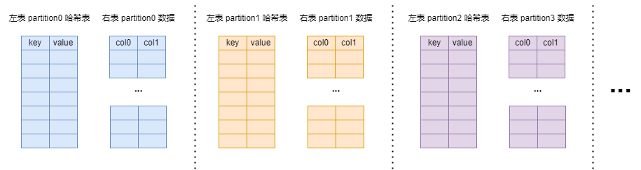
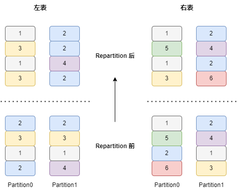
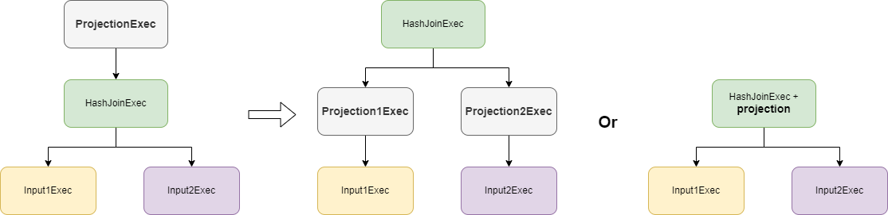

+++
title = "DataFusion 查询引擎 Hash Join"
date = 2025-01-13
draft = true
+++

对于含有等值连接条件的 Join，可以采用 Hash Join 方式进行加速计算，它利用了哈希表的查询特性，其本身也可以更好的并行化。

## 场景
主要用于 On 子句中含有等值连接条件的 Join 运算。例如默认用户配置下：表 `t0(a int, b int)` 和 `t1(c int, d int)`
1. `select * from t0 join t1 on t0.a = t1.c` 有一个 On 条件且是等值条件，走 Hash Join 算子
2. `select * from t0 join t1 on t0.a > t1.c` 有一个 On 条件但非等值条件，走 Nested Loop Join 算子
3. `select * from t0 join t1 on t0.a > t1.c and t0.b = t1.d` 有多个 On 条件且其中包含等值条件，走 Hash Join 算子

## 执行模式
Hash Join 有两种执行模式：CollectLeft 和 Partitioned
- CollectLeft 模式更加通用，会先将左表数据全部读取出来构建哈希表，然后跟右表 join
- Partitioned 模式并行度更高，但要求左右表的 partition 数量相同并且分区方式都是以等值条件中的表达式进行哈希分区（例如 `on t0.a = t1.c`，左表需要按照 `t0.a` 进行哈希分区，右表需要按照 `t1.c` 进行哈希分区），它只需将左右表对应 partition 数据进行 join，无需构建一个全局的哈希表
    

**Partitioned 模式下左右表数据的分布**：左右表中具有相同 join keys 的行一定被分布到左右对应相同的 partition 中（例如左右表中 join key 值为 2 的行均被分布到各自的 1 号 partition 中）。

执行模式选择策略：
1. 当用户希望并行度为 1 时，会采用 CollectLeft 模式
2. 当用户不希望运行时收集统计数据时，默认走 Partitioned 模式
3. 通过统计数据来选择执行模式，如果左右表数据量至少有一个比较小，则走 CollectLeft 模式，否则走 Partitioned 模式

## 优化
Hash Join 主要参与以下优化
1. projection push down：优化器会尝试将 projection 下推到 Hash Join 算子的输入，如果无法下推，会尝试将 projection 嵌入到 Hash Join 算子中
    
2. enforce distribution：
    - TODO 调整 join keys 顺序，让左右表的数据跟 join keys 的顺序一致
    - 对于 CollectLeft 模式，在左表上插入 Coalesce Partitions / Sort Preserving Merge 算子，将其所有 partition 合并成 1 个
    - 对于 Partitioned 模式，在左右表上插入 Repartition 算子，将其分区方式改成按等值条件哈希分区
3. join selection
    - 优化器会根据 join 两边输入的统计信息，将小表放到左侧，大表放到右侧
    - 如果左右输入均为无界且增量的（增量的意思是例如 filter 这种接收一批处理一批），则转换为 Symmetric Hash Join

## 执行

以 Partition 模式为例，SQL 为 `select * from t0 full join t1 on t0.a = t1.c and t0.b > t1.d`，左右表的每个 partition 都会经历如下阶段，以第 0 号 partition 为例

### 第一阶段：build 阶段

对左表的 partition0 所有数据构建哈希表，其中 key 为 `t0.a` 列值的哈希值，value 为行索引（这里会处理哈希冲突情况）。

### 第二阶段：probe 阶段

probe 阶段不断读取右表 partition0 的数据，与左表 partition0 数据进行 join。

第一步，从右表读取一批数据，构建这一批数据的哈希表，其 key 为行索引，value 为 `t1.c` 列值的哈希值

第二步，使用第一步中构建的哈希表，从 build 阶段构建的左表的哈希表中查找满足等值条件的行的索引

## 哈希表设计

如何解决哈希冲突